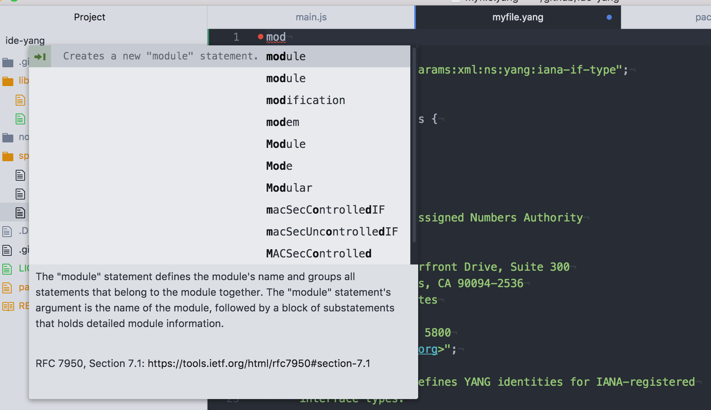

# IDE-YANG package

YANG integration with [yang-language-server](https://github.com/yang-tools/yang-lsp) for Atom.

Requires Atom 1.21 or later with atom-ide-ui package.

# Setup

1. Install Atom 1.21 or later and the [atom-ide-ui](https://atom.io/packages/atom-ide-ui) package.
1. Install the [ide-yang](https://atom.io/packages/ide-yang) package.
1. Download and build the [yang-language-server](https://github.com/yang-tools/yang-lsp).  This requires Java and Gradle.
1. Configure ide-yang settings to the path to yang-language-server executable.  After building, it should exist in `yang-lsp/yang-lsp/io.typefox.yang.diagram/build/install/yang-language-server/bin`.
1. Install the [language-yang](https://atom.io/packages/language-yang) package.

# License

MIT License.  See [license](LICENSE.md) for details.
